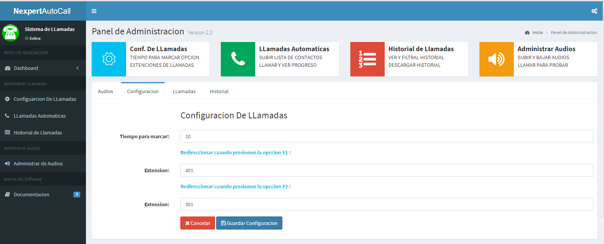
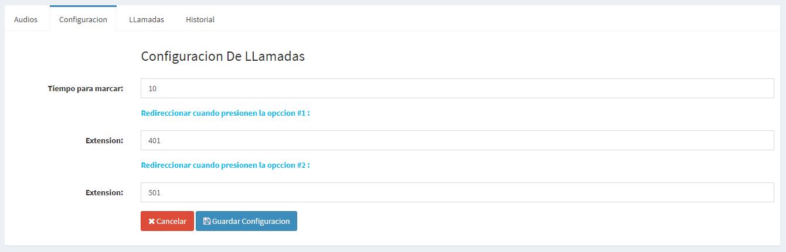
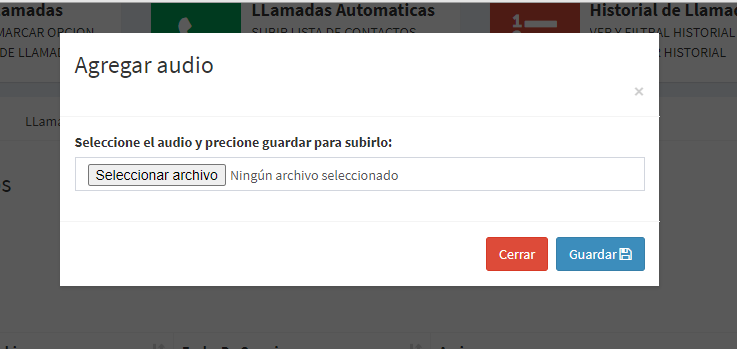
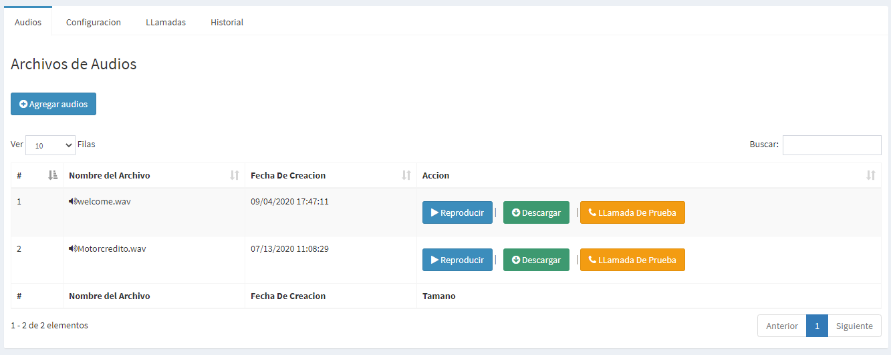
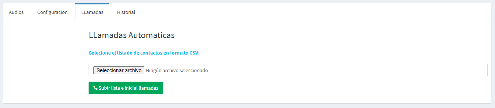
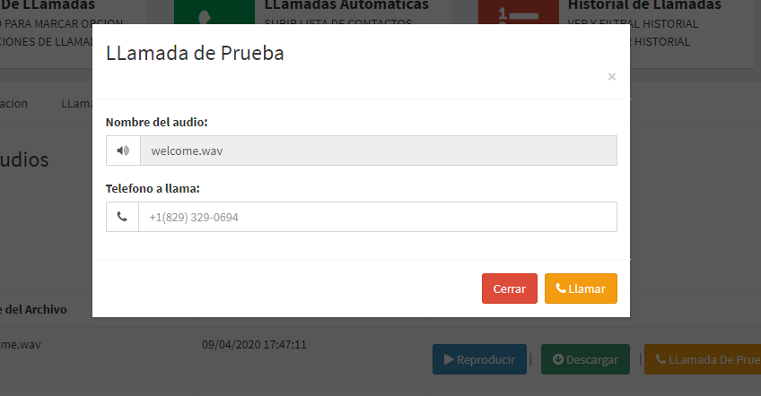

# NexpertAutoCall
NexpertAutoCall es el proyecto de una aplicación escrita en PHP y DB MariaDB para que Asterisk envíe transmisiones de voz de forma masiva.

<h3  style="text-align: center; color:cornflowerblue;">Capturas de pantalla</h3>

<h3  style="text-align: left; ">Panel de Administracion</h3>

<h3  style="text-align: left; ">Configuracion De LLamadas</h3>

<h3  style="text-align: left; ">Archivos de Audios</h3>

<h3  style="text-align: left; ">LLamadas Automaticas</h3>

<h3  style="text-align: left; ">LLamadas Independientes</h3>

<h3  style="text-align: left; ">Seguimientos de LLamadas (progreso en tiempo real)</h3>

<h3  style="text-align: left; ">Historial de Llamadas</h3>

